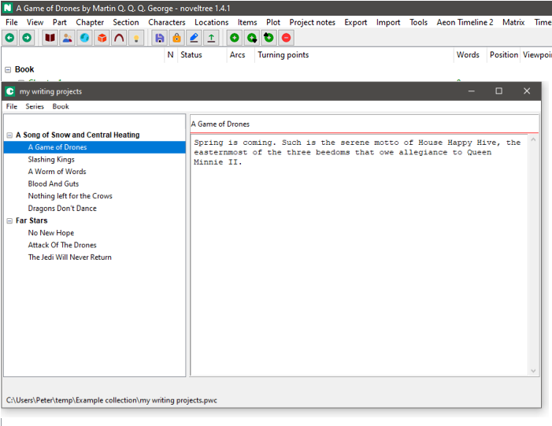

# noveltree_collection

The [noveltree](https://peter88213.github.io/noveltree/) Python program helps authors organize novels.  

*noveltree_collection* is a plugin providing a book/series collection manager. 

## Features

- Show a tree with series and books.
- Each book can stand alone, or belong to a series.
- Show book/series title and description.
- Load the selected book into noveltree by double-click. 
- Handle multiple collections, represented by XML files with the extension *.nvcx*.

## Requirements

- [noveltree](https://peter88213.github.io/noveltree/) version 1.0+

## Download and install

[Download the latest release (version 1.1.0)](https://github.com/peter88213/noveltree_collection/raw/main/dist/nv_collection_v1.1.0.zip)

- Extract the "nv_collection_v1.1.0" folder from the downloaded zipfile "nv_collection_v1.1.0.zip".
- Move into this new folder and launch **setup.pyw**. This installs the plugin for the local user.

---

[Changelog](changelog)

## Usage

See the [instructions for use](usage)

## License

This is Open Source software, and the *noveltree_collection* plugin is licensed under GPLv3. See the
[GNU General Public License website](https://www.gnu.org/licenses/gpl-3.0.en.html) for more
details, or consult the [LICENSE](https://github.com/peter88213/noveltree_collection/blob/main/LICENSE) file.
